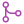

<!--this comment is auto-replaced on deployment-->
<!--styles-->
<link rel="stylesheet" type="text/css" href="https://fonts.googleapis.com/css?family=Overpass+Mono">

*Peace is key*

## Hi there. I'm [**WhiteBlackGoose**](https://github.com/WhiteBlackGoose).

I work on **FOSS** (Free Open Source Software) projects in the area of **.NET**, to be precise, **C#** and **F#**, trying to make .NET greater and more suitable for scientific purposes. I've been into this area for **2** years.

I'm a member of <a href="https://angouri.org">**Angouri**</a>, <a href="http://dotnetfoundation.org">**.NET Foundation**</a>, and <a href="https://www.fsf.org">**Free Software Foundation**</a>, and author of [**AngouriMath**](http://github.com/asc-community/AngouriMath). See all my contributions in the next expanders.

<strong>🤓 Biography</strong> (click)

  
### Coding

Back in childhood I started programming with Delphi, with which I created a few nice programs, that I enjoyed back then. My next major programming language was python, I worked with neural networks, in particular, HI-19 (see link below), which analyzes handwriting by photo. Eventually though I started learning C# ... and that's the first language I *actually* learned. I started with basic console apps, tried to make a website. In 2019 found myself in need for a symbolic algebra library, and that's when I started working on AngouriMath.
  
AngouriMath is the first FOSS project I made. In 2020 AngouriMath's repo gets visited by Happypig375, who finds bugs, makes suggestions, and opens pull requests. Thanks to him I immersed myself into the wonders of FOSS. In that year I also create GenericTensor and a few small projects.
  
In 2021 I started realizing that C# is not as expressive as I wish it was, despite that I know it almost perfectly. I finally try F#. My world changes again, now I learn it from a different point of view. In that year I create a whole number of different projects, contribute to others as well, such as Silk.NET, and more. I also join .NET Foundation and set up my patreon page.
  
In the same year I was helping with programming language Fresh as well as planned many rewrites of GenericTensor, Plotly.NET, AngouriMath, and more.

In 2022 I decided to try something new and to learn UI in MVU via F#, so I do a few things related to it. Then, on [24 Feb - 30 May] I basically didn't code.
  
### Science

I've always loved math. I'm not a professional mathematician, however, I definitely enjoy it and understand some of it.

My main project I made in .NET is a math library AngouriMath. It relates to algebra and symbolic computations. It is supplied by another library, GenericTensor, which is a *linear algebra* library.

I absolutely enjoy fundamental math and logic. For me it's something that describes it all.

Finally, since I started doing F#, I was also interested in functional programming, proof oriented programming, and finally, type theory. For proof oriented programming I even started learning F* and made a few hello worlds.

I also like economics and finances, trying to learn and explain how things work in today's world. Same relates to history and politics.

In the end, my favourite sciences are: logic, symbolic algebra, computer science, type theory, and economics.

### Me on society

I'm not very open in real life. I don't even often see people irl. I mostly exist online. I even think people can exist fully online. It sounds a bit dystopian... but yeah.

You can find me on twitter, reddit, and discord. I love talking, and there are many topics I can talk about. Lately it's mostly been society (I've become much more progressive), science (type theory), and art.

I write quite a lot. I have a page (see in the end) where I keep all articles I ever wrote in one place. Those articles are mostly about software developing, however, I plan to extend it (e. g. I recently wrote about investments, and I soon hope to write about FOSS).

### Other hobbies

Turned out that I love drawing polandball. It's a special community, worth checking out!

I also like learning languages. Well... not so much learning, but the result. I'm learning :de: ( :ru: is my native language, :us: is C1-C2). 
  
  

<strong>🧪 Projects I'm involved in</strong> (click)

My NuGet profile: 
  
Each project is either maintained by me or I contributed to it.
  
- I ⭐-ed the projects which I find awesome and best in their areas.
- I 🦆-ed the projects which I created and actively maintain up to date.

#### Science/Theory
  
1. <a href="https://am.angouri.org">AngouriMath</a> (2019-2022) 🦆⭐
1. <a href="https://github.com/plotly/Plotly.NET">Plotly.NET</a> (2021-2022) ⭐
1. <a href="https://github.com/asc-community/GenericTensor">GenericTensor</a> (2020-2022) 🦆
1. <a href="https://github.com/dotnet/interactive">Interactive</a> (2021) ⭐
1. <a href="https://github.com/WhiteBlackGoose/QuantumComputingMatrices">Quantum almanac</a> (2021)
  
#### General purpose libraries / collections
1. <a href="https://github.com/WhiteBlackGoose/HonkSharp">Honk#</a> (2021) 🦆⭐
1. <a href="https://github.com/WhiteBlackGoose/HonkPerf.NET">HonkPerf.NET</a> (2021) 🦆
1. <a href="https://github.com/ZacharyPatten/Towel">Towel</a> (2020)
1. <a href="https://github.com/WhiteBlackGoose/Yadg.NET">Yadg.NET</a> (2021)
1. <a href="https://github.com/WhiteBlackGoose/MinimalismSinglePageWebsiteTemplate">Template for one-page website</a> (2021)
1. <a href="https://github.com/WhiteBlackGoose/WebAppMinimalTemplate">Web app template</a> (2021)
1. <a href="https://github.com/WhiteBlackGoose/UsefulCodeSnippets">Code snippets</a> (2021)
1. <a href="https://github.com/WhiteBlackGoose/FieldCache">FieldCache</a> (deprecated, moved to Honk#) (2020)
1. <a href="https://github.com/WhiteBlackGoose/MoreFuncUI">MoreFuncUI</a> (2022)
  
#### Tools/apps/games
1. <a href="https://github.com/WhiteBlackGoose/FunConsoleGame">Fun console game</a> (2021)
1. <a href="https://github.com/jonsequitur/dotnet-repl">dotnet-repl</a> (2021) ⭐
1. <a href="https://github.com/WhiteBlackGoose/hgt2png">Hgt2png</a> (2021)
1. <a href="https://whiteblackgoose.github.io/TypeInfo/">.NET type inspector</a> (2021)
1. <a href="https://github.com/WhiteBlackGoose/NaiveCSharpFSharpEval">Simple C#/F# evaluator</a> (2021)
1. <a href="https://github.com/WhiteBlackGoose/AngouriMath.Terminal">AngouriMath.Terminal</a> (deprecated, moved to AngouriMath) (2021)
1. <a href="https://github.com/WhiteBlackGoose/MoreBadges">More badges</a>
1. <a href="https://github.com/WhiteBlackGoose/CodegenAnalysis">CodegenAnalysis</a> (2021-2022) 🦆
1. <a href="https://github.com/WhiteBlackGoose/dotnet-proj">dotnet-proj</a> (2022) 🦆
1. <a href="https://github.com/WhiteBlackGoose/json2fs">json2fs</a> (2022) 🦆

#### Conceptual projects
That is, they are not ready-to-use libraries, instead, some theoretical concepts, that may or may not be implemented.
1. <a href="https://github.com/LanguageDev/Fresh-Language-suggestions">Fresh</a> (2021-2022)
1. <a href="https://github.com/WhiteBlackGoose/InductiveVariadics">InductiveVariadics</a> (2022) 🦆
1. <a href="https://github.com/WhiteBlackGoose/LambdaCalculusFSharp">λ calculus calculator</a> (2021)
1. <a href="https://github.com/WhiteBlackGoose/SetSystem">SetSystem</a> (2021)
1. <a href="https://github.com/WhiteBlackGoose/UnitsOfMeasure">UnitsOfMeasure</a> (2021)
1. <a href="https://github.com/WhiteBlackGoose/GuessBigO">Guess Big O</a> (2021) 🦆
  
#### Other  
1. <a href="https://github.com/dotnet/Silk.NET">Silk.NET</a> (2021-2022) ⭐
1. <a href="https://github.com/asc-community/dotnet-benchmarks">DotnetBenchmarks</a> (2020-2021)
1. <a href="https://github.com/dotnet/runtime">Runtime</a> (2021)
  

<strong>Old projects</strong>

<ul>
<li>
<a href="https://github.com/WhiteBlackGoose/Crystals">Crystals game</a> (2019)
  </li>
  <li>
<a href="https://github.com/WhiteBlackGoose/fill2">Fill game</a> (2019)
  </li>
  <li>
<a href="https://github.com/WhiteBlackGoose/HI19">HI19 handwriting recognition system</a> (2018-2019)
  </li>
  <li>
<a href="https://github.com/WhiteBlackGoose/LogicSchemeEmulator">Logic Scheme Emulator</a> (2017)
  </li>
  <li>
<a href="https://github.com/WhiteBlackGoose/GunsVsMonsters">Guns vs Monsters</a> (2016)
  </li>
  <li>
<a href="https://github.com/WhiteBlackGoose/leostudio">Leo Studio</a> (2016)
  </li>
      <li>
<a href="https://github.com/WhiteBlackGoose/old_projects">Other old projects</a> (2015-2016)
  </li>
  <li>
<a href="https://github.com/WhiteBlackGoose/BounceMan">BounceMan</a> (2015)
  </li>
  <li>
<a href="https://github.com/WhiteBlackGoose/MyProgram">MyProgram</a> (2014)
  </li>
</ul>
  

  

<strong> My merged pull requests</strong> (click)

  
Most notable ones:
- [SIMD for Silk.NET.Math #3](https://github.com/dotnet/Silk.NET/pull/684)
- [SIMD for Silk.NET.Math #2](https://github.com/dotnet/Silk.NET/pull/670)
- [SIMD for Silk.NET.Math](https://github.com/dotnet/Silk.NET/pull/665)
- [Scalar bitwise implementation](https://github.com/dotnet/Silk.NET/pull/667)
- [Generic Math impl](https://github.com/asc-community/AngouriMath/pull/509)
- [C# Interop improvements](https://github.com/plotly/Plotly.NET/pull/161)
- [Immutable dynamic object](https://github.com/CSBiology/DynamicObj/pull/4)
- [Lambdas and functions](https://github.com/asc-community/AngouriMath/pull/496)
- [Add RFC-1112 - "Obsolete allowed to use Obsolete"](https://github.com/fsharp/fslang-design/pull/617)
  
I groupped my PRs into hierarchy. Each subgroup is exhaustive and covers all PRs from its parent node.
  
- [All](https://github.com/search?o=desc&q=is%3Aclosed+is%3Apull-request+author%3AWhiteBlackGoose+archived%3Afalse+is%3Amerged&s=updated&type=Issues) 
  - [Angouri](https://github.com/search?o=desc&q=is%3Aclosed+is%3Apull-request+author%3AWhiteBlackGoose+archived%3Afalse+is%3Amerged+org%3Aasc-community&s=updated&type=Issues)
    - [AngouriMath](https://github.com/search?o=desc&q=is%3Aclosed+is%3Apull-request+author%3AWhiteBlackGoose+archived%3Afalse+is%3Amerged+repo%3Aasc-community%2FAngouriMath&s=updated&type=Issues)
    - [*Other*](https://github.com/search?o=desc&q=is%3Aclosed+is%3Apull-request+author%3AWhiteBlackGoose+archived%3Afalse+is%3Amerged+-repo%3Aasc-community%2FAngouriMath+org%3Aasc-community&s=updated&type=Issues)
  - [.NET](https://github.com/search?o=desc&q=is%3Aclosed+is%3Apull-request+author%3AWhiteBlackGoose+archived%3Afalse+is%3Amerged+org%3Adotnet&s=updated&type=Issues)
    - [Silk.NET](https://github.com/search?o=desc&q=is%3Aclosed+is%3Apull-request+author%3AWhiteBlackGoose+archived%3Afalse+is%3Amerged+repo%3Adotnet%2FSilk.NET&s=updated&type=Issues)
    - [*Other*](https://github.com/search?o=desc&q=is%3Aclosed+is%3Apull-request+author%3AWhiteBlackGoose+archived%3Afalse+is%3Amerged+-repo%3Adotnet%2FSilk.NET+org%3Adotnet&s=updated&type=Issues)
  - [Plotly](https://github.com/search?o=desc&q=is%3Aclosed+is%3Apull-request+author%3AWhiteBlackGoose+archived%3Afalse+is%3Amerged+org%3Aplotly&s=updated&type=Issues)
    - [Plotly.NET](https://github.com/search?o=desc&q=is%3Aclosed+is%3Apull-request+author%3AWhiteBlackGoose+archived%3Afalse+is%3Amerged+org%3Aplotly+repo%3Aplotly%2FPlotly.NET&s=updated&type=Issues)
  - [*Other*](https://github.com/search?o=desc&q=is%3Aclosed+is%3Apull-request+author%3AWhiteBlackGoose+archived%3Afalse+is%3Amerged+-org%3Aasc-community+-org%3Adotnet+-org%3Aplotly&s=updated&type=Issues)
  

<strong>📚 My articles</strong> (click)

Most notable ones in 🇺🇸:
- `[2022-02-22]	👁️‍🗨️  3k` [**Don’t underestimate Recursion: it’s far more powerful, than most people think**](https://itnext.io/dont-underestimate-recursion-it-s-far-more-powerful-than-most-people-think-130a1077f3a6)
- `[2022-02-05]	👁️‍🗨️	11k` [**Inline Assembly in F#! How does it work?**](https://blog.devgenius.io/inline-assembly-in-f-net-language-6d70ab9f58c1)
- `[2022-01-31] 👁️‍🗨️	 2k` [**This is how Variadic Arguments could work in C#**](https://whiteblackgoose.medium.com/this-is-how-variadic-arguments-could-work-in-c-e2034a9c241)
- `[2022-01-03]	👁️‍🗨️	12k` [**Like regular LINQ, but faster and without allocations**](https://whiteblackgoose.medium.com/3d4724632e2a)
- `[2021-12-22]	👁️‍🗨️	 5k` [**Stay safe with your units! Advanced units of measure in .NET**](https://whiteblackgoose.medium.com/stay-safe-with-your-units-advanced-units-of-measure-in-net-f7d8b02af87e)
- `[2021-09-02]	👁️‍🗨️	13k` [**Making loop "foreach" as fast as "for"**](https://habr.com/en/post/575916/)
- `[2021-03-14]	👁️‍🗨️  4k` [**Compilation of symbolic expressions into Linq.Expression**](https://habr.com/en/post/546926/)
- `[2020-02-02] 👁️‍🗨️  5k` [**Symbolic algebra in C#**](https://habr.com/en/post/486496)

Most notable ones in 🇷🇺:
- `[2022-01-30] 👁️‍🗨️ 20k` [**Как LINQ, только быстрый и без аллокаций**](https://habr.com/ru/post/648529/)
- `[2021-09-01] 👁️‍🗨️ 15k` [**Ускоряем цикл foreach до for**](https://habr.com/ru/post/575664/)
- `[2020-11-18] 👁️‍🗨️ 7k` [**Jupyter для .NET. «Как в питоне»**](https://habr.com/ru/post/528730/)
- `[2020-01-03] 👁️‍🗨️ 53k` Пишем «калькулятор» на C# [**Часть I**](https://habr.com/ru/post/482228/) [**Часть II**](https://habr.com/ru/post/483294/)
  
[**All of them**](https://wbg.angouri.org/blog/)

<strong>📈 Activity</strong> (click)

<strong>🎓 Stack</strong> (click)

Some things I'm learning, some things I know, some I just like.

   

   

   

  

 

 

#### You can
- Checkout my [**twitter**](https://twitter.com/WhiteBlackGoose), [**github**](https://github.com/WhiteBlackGoose), [**blog**](https://wbg.angouri.org/blog).
- ~~Support me on <a href="https://patreon.com/WhiteBlackGoose">**Patreon**</a>.~~
- Contact me via e-mail (wbg@angouri.org) or Telegram (the same username as that on GH).

*This text is mirrored to a personal [web-page](https://wbg.angouri.org).*
